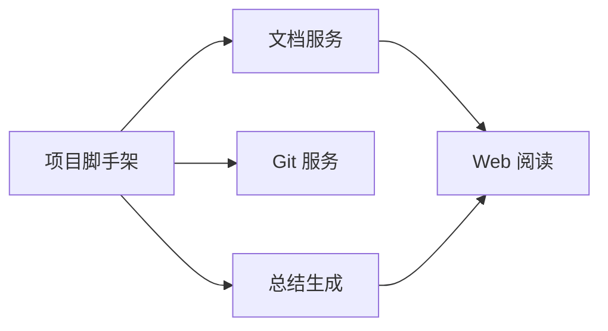

---
title: 每日修改总结 · 2026-07-17
date: 2026-07-17
tags: [daily, summary, sample]
generated_by: md_online
---

# 每日修改总结 · 2026-07-17（示例）

## 一句话概述

初始化 `md_online`：实现 Markdown 在线阅读、Git 变更采集与每日总结 API/工作台。

## 主要改动

- **server**：Express API（docs / git / summary）
- **client**：React 文档浏览与总结工作台
- **docs**：使用指南与 API 文档

## 变更结构图

## 统计

- 示例文档，真实统计请在工作台重新生成
