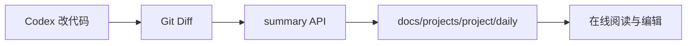

# Sivan Note 使用指南

`Sivan Note` 是本地 Markdown 知识库，并提供基于 Git 变更的**每日修改总结**能力，方便 Codex 改完代码后归档日报。

## 快速开始

```bash
npm install
cp .env.example .env
npm run dev
```

- 前端：http://127.0.0.1:5173
- API：http://127.0.0.1:8787

`npm install` 会安装根目录与 `client` / `server` 依赖。

## 文档浏览与编辑

- 将 `.md` 文件放入 `docs/` 目录
- 支持 GFM、代码高亮、Mermaid 图、YAML frontmatter
- 左侧目录树可折叠，当前文档路径会自动展开
- 打开文档后可点击 **编辑** 在线修改并保存（需 `ALLOW_WRITE=true`）

## 搜索

- 打开 **搜索** 页，输入关键词后自动搜索
- 标题命中优先排序，结果中会高亮关键词

## 每日总结

1. 打开 **总结工作台**
2. 选择项目 / 日期 / 风格，可选路径过滤与 baseRef
3. 点击 **生成预览** 或 **生成并保存**
4. 文件默认写入 `docs/projects/<project>/daily/YYYY-MM-DD.md`（本地时区）
5. 若目标已存在，会提示确认覆盖

也可以用 API：

```bash
curl -X POST http://127.0.0.1:8787/api/summary/daily \
  -H "Content-Type: application/json" \
  -d "{\"project\": \"md_online\", \"save\": true, \"force\": true, \"language\": \"zh-CN\"}"
```

## 鉴权

若 `.env` 中设置了 `AUTH_TOKEN`：

1. 服务端所有 `/api/*` 需 Bearer Token
2. 前端在 **设置** 页保存相同 Token
3. CLI 通过 `AUTH_TOKEN` 或 `SIVAN_NOTE_TOKEN` 环境变量传递

## 变更结构示意



## 配置 LLM（可选）

在 `.env` 中：

```env
LLM_ENABLED=true
OPENAI_API_KEY=sk-...
OPENAI_BASE_URL=https://api.openai.com/v1
OPENAI_MODEL=gpt-4o-mini
```

未配置时使用本地模板模式，仍可生成含统计与 Mermaid 的总结。LLM 失败会自动回退模板，并在响应中给出 `fallbackReason`。
